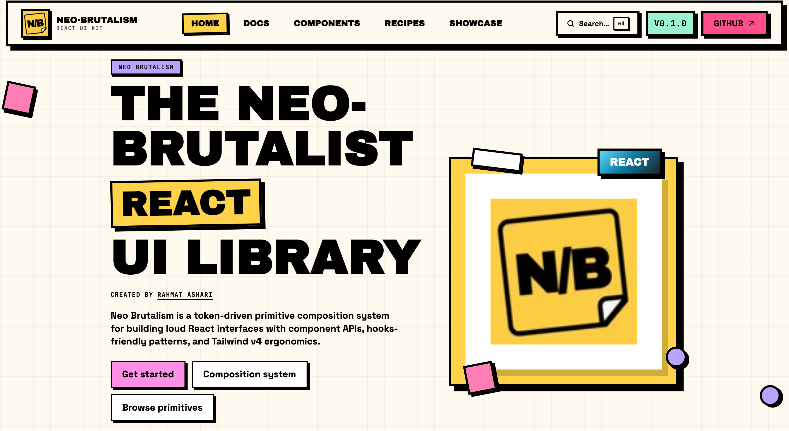

# Neobrutalism React UI KIT

[](https://www.npmjs.com/package/neobrutalism-ui-react)
[](https://www.npmjs.com/package/neobrutalism-ui-react)
[](https://github.com/rahmatez/neo-brutalism-react/actions/workflows/ci.yml)
[](./LICENSE)

Neo-brutalist React UI primitive library — bold borders, hard shadows, and Tailwind CSS v4 tokens. A React port inspired by [ng-brutalism](https://github.com/khangtrannn/ng-brutalism), with a full documentation site, composition recipes, and showcase.

**[Documentation](https://neo-brutalism-react-docs.vercel.app/)** ·
**[npm](https://www.npmjs.com/package/neobrutalism-ui-react)** ·
**[GitHub](https://github.com/rahmatez/neo-brutalism-react)** ·
**[Issues](https://github.com/rahmatez/neo-brutalism-react/issues)** ·
**[Changelog](./packages/ui/CHANGELOG.md)** ·
**[Contributing](./CONTRIBUTING.md)**

Created by [Rahmat Ashari](https://github.com/rahmatez).

[](https://neo-brutalism-react-docs.vercel.app/)

## Table of contents

- [Highlights](#highlights)
- [Explore](#explore)
- [Install](#install-consumers)
- [Monorepo development](#monorepo)
- [Deployment](#deployment)
- [Contributing & changelog](#contributing--changelog)
- [License](#license)

## Highlights

- **70+ primitives** — actions, forms, overlays, data display, media, charts, and layout building blocks
- **Composition system** — `Surface`, `Section`, `Stack`, `Cluster`, `Split`, and related layout primitives
- **Token-driven styling** — CSS custom properties + Tailwind v4 utilities via `cn()` and `resolveNbStyles`
- **Accessible patterns** — native semantics where possible, ARIA for complex widgets
- **Tree-shakeable ESM** — published as [`neobrutalism-ui-react`](https://www.npmjs.com/package/neobrutalism-ui-react) with TypeScript declarations
- **React 18+** — developed on React 19; peer dependency `react >= 18`
- **Optional peer deps** — install Radix, cmdk, recharts, etc. only for the components you use

## Explore

| Resource | Link |
|----------|------|
| Docs home | [neo-brutalism-react-docs.vercel.app](https://neo-brutalism-react-docs.vercel.app/) |
| Installation | [/docs/installation](https://neo-brutalism-react-docs.vercel.app/docs/installation) |
| Components | [/components/button](https://neo-brutalism-react-docs.vercel.app/components/button) |
| Composition | [/composition/overview](https://neo-brutalism-react-docs.vercel.app/composition/overview) |
| Recipes | [/recipes/travel-card](https://neo-brutalism-react-docs.vercel.app/recipes/travel-card) |
| Portfolio showcase | [/showcase/portfolio](https://neo-brutalism-react-docs.vercel.app/showcase/portfolio) |

### Component categories

**Layout & composition** — Surface, Section, Stack, Cluster, Split, Resizable, Sidebar  
**Actions** — Button, Icon Button, Chip, Badge  
**Forms** — Input, Textarea, Select, Checkbox, Switch, Slider, Radio Group, Form, Combobox, Date Picker, Input OTP, Input Group, Label  
**Overlays** — Dialog, Drawer, Sheet, Alert Dialog, Popover, Tooltip, Toast, Dropdown Menu, Context Menu, Hover Card  
**Navigation** — Tabs, Breadcrumb, Pagination, Menubar, Navigation Menu, Command  
**Data display** — Table, Data Table, Chart, Calendar, Carousel, Accordion, Stat, Progress, Skeleton  
**Media & effects** — Avatar, Avatar Group, Image Card, Marquee, Halftone, Sticker, Media Frame, Media Item, Display, Callout  
**Typography** — Text, Title, Typography, Rating, Status Dot  

Full list in the [components docs](https://neo-brutalism-react-docs.vercel.app/components/button).

## Install (consumers)

### Requirements

Your app needs **React 18+**, **React DOM 18+**, and **Tailwind CSS v4** before adding this library.

### Package

```bash
pnpm add neobrutalism-ui-react
# or
npm install neobrutalism-ui-react
```

### Styles & Tailwind scanning

Import Tailwind and the library stylesheet in your app entry CSS (e.g. `src/styles.css`).  
Use `@source` so Tailwind v4 scans utility classes shipped in the package:

```css
@import "tailwindcss";
@import "neobrutalism-ui-react/styles.css";

/* Adjust the path to match your CSS file location */
@source "../node_modules/neobrutalism-ui-react/dist";
```

- **`styles.css`** — Tailwind theme tokens + base styles (recommended default).
- **`theme.css`** — token sheet only; use when you already manage Tailwind elsewhere and only need CSS variables.

### Usage

```tsx
import { Button } from 'neobrutalism-ui-react';

export function Example() {
  return (
    <Button tone="background" style={{ '--nb-button-bg': '#fff' } as React.CSSProperties}>
      Ship it
    </Button>
  );
}
```

### Provider (optional)

```tsx
import { NeoBrutalismProvider } from 'neobrutalism-ui-react';

<NeoBrutalismProvider
  theme={{
    radius: '0px',
    borderWidth: '3px',
  }}
>
  <App />
</NeoBrutalismProvider>
```

`NeoBrutalismProvider` is optional — you can override theme tokens via CSS custom properties instead.

### Dependencies on npm

**Required peer dependencies** (install in your app):

| Package | Version |
|---------|---------|
| `react` | `>=18` |
| `react-dom` | `>=18` |
| `tailwindcss` | `^4.0.0` |

**Bundled with the package:** `clsx`, `tailwind-merge`

**Optional peer dependencies** — install only for the components you import:

| Package | Used by |
|---------|---------|
| `@radix-ui/react-context-menu` | Context Menu |
| `@radix-ui/react-hover-card` | Hover Card |
| `@radix-ui/react-menubar` | Menubar |
| `@radix-ui/react-navigation-menu` | Navigation Menu |
| `cmdk` | Command |
| `react-hook-form` | Form |
| `react-resizable-panels` | Resizable |
| `recharts` | Chart |

```bash
pnpm add @radix-ui/react-context-menu @radix-ui/react-hover-card \
  @radix-ui/react-menubar @radix-ui/react-navigation-menu \
  cmdk react-hook-form react-resizable-panels recharts
```

See the [Installation guide](https://neo-brutalism-react-docs.vercel.app/docs/installation) for full setup details.

## Monorepo

| Package | Path | Description |
|---------|------|-------------|
| `neobrutalism-ui-react` | [`packages/ui`](./packages/ui) | Publishable component library |
| `@neobrutalism-ui/docs` | [`apps/docs`](./apps/docs) | Vite + React Router documentation site |

**Tooling:** pnpm workspaces, Turborepo, TypeScript, Vitest, Playwright.

### Requirements

- **Node.js** ≥ 20.19
- **pnpm** 9.x (`corepack enable` recommended)

### Development

```bash
git clone https://github.com/rahmatez/neo-brutalism-react.git
cd neo-brutalism-react
pnpm install

# Build the UI package first (docs consume dist/, not source)
pnpm --filter neobrutalism-ui-react build

# Docs dev server → http://localhost:5173
pnpm --filter @neobrutalism-ui/docs dev

# Or run all dev tasks via Turbo
pnpm dev
```

### Scripts

| Command | Description |
|---------|-------------|
| `pnpm dev` | Start dev tasks (Turbo) |
| `pnpm build` | Build all packages |
| `pnpm lint` | Type-check all packages |
| `pnpm test` | Unit + integration tests (UI) and route smoke tests (docs) |
| `pnpm --filter @neobrutalism-ui/docs test:e2e` | Playwright smoke tests against built docs |
| `pnpm changeset` | Add a changeset for `neobrutalism-ui-react` |
| `pnpm version-packages` | Apply changesets and bump versions |
| `pnpm release` | Build UI package and publish to npm |

### Testing

```bash
# All tests
pnpm test

# UI only
pnpm --filter neobrutalism-ui-react test

# Docs route smoke (Vitest)
pnpm --filter @neobrutalism-ui/docs test

# Docs E2E (requires docs build)
pnpm build
pnpm --filter @neobrutalism-ui/docs test:e2e
```

### Project structure

```
neo-brutalism-react/
├── apps/docs/          # Documentation site (Vite, React Router)
├── packages/ui/        # neobrutalism-ui-react component library
├── .github/workflows/  # CI, deploy-docs, release
├── .changeset/         # Version management
└── turbo.json
```

## Deployment

### Documentation (Vercel — primary)

Live docs: **[neo-brutalism-react-docs.vercel.app](https://neo-brutalism-react-docs.vercel.app/)**

Connect the repo in [Vercel](https://vercel.com) with:

| Setting | Value |
|---------|-------|
| **Root Directory** | `apps/docs` |
| **Build Command** | `cd ../.. && pnpm install && pnpm --filter neobrutalism-ui-react build && pnpm --filter @neobrutalism-ui/docs build` |
| **Output Directory** | `dist` |
| **Install Command** | `pnpm install` (from monorepo root) |

Do **not** set `GITHUB_PAGES=true` on Vercel — that env is only for the GitHub Pages backup build.

SPA routing is handled by [`apps/docs/vercel.json`](./apps/docs/vercel.json).

Local production preview (matches Vercel):

```bash
pnpm --filter neobrutalism-ui-react build
pnpm --filter @neobrutalism-ui/docs build
pnpm --filter @neobrutalism-ui/docs preview
```

### Documentation (GitHub Pages — backup)

Optional mirror at `https://rahmatez.github.io/neo-brutalism-react/`. Deploy manually via **Actions → Deploy Docs (GitHub Pages backup) → Run workflow** ([`.github/workflows/deploy-docs.yml`](./.github/workflows/deploy-docs.yml)).

Requires **Settings → Pages → Source: GitHub Actions** once: [github.com/rahmatez/neo-brutalism-react/settings/pages](https://github.com/rahmatez/neo-brutalism-react/settings/pages)

To build locally for GitHub Pages (subpath `/neo-brutalism-react/`):

```bash
GITHUB_PAGES=true pnpm --filter @neobrutalism-ui/docs build
pnpm --filter @neobrutalism-ui/docs preview
```

### npm package

Publishing uses [Changesets](https://github.com/changesets/changesets) and [`.github/workflows/release.yml`](./.github/workflows/release.yml).

1. Package name on npm: **`neobrutalism-ui-react`** (unscoped).
2. Add an `NPM_TOKEN` secret to the GitHub repository.
3. Run `pnpm changeset` locally, commit, and push to `main`.

## Contributing & changelog

- **[Contributing guide](./CONTRIBUTING.md)** — dev setup, tests, changesets, PR scope
- **[Changelog](./packages/ui/CHANGELOG.md)** — release history for `neobrutalism-ui-react`

CI on every push and pull request: build, lint, unit/integration tests, and Playwright docs smoke tests.

## License

[MIT](./LICENSE) © [Rahmat Ashari](https://github.com/rahmatez)
